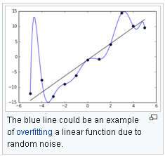
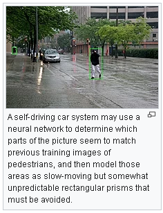

<!DOCTYPE html>
<!--[if lt IE 7]>      <html class="no-js lt-ie9 lt-ie8 lt-ie7"> <![endif]-->
<!--[if IE 7]>         <html class="no-js lt-ie9 lt-ie8"> <![endif]-->
<!--[if IE 8]>         <html class="no-js lt-ie9"> <![endif]-->
<!--[if gt IE 8]><!--> <html class="no-js"> <!--<![endif]-->
    <head>
        <meta charset="utf-8">
        <meta http-equiv="X-UA-Compatible" content="IE=edge,chrome=1">
        <title>Arabic HTML - Slide pages</title>
        <meta name="viewport" content="width=device-width">
		<link rel="icon" type="image/png" href="horus-favicon.png" />
        <link rel="stylesheet" href="css/arabic.responsive.min.css">
        <link rel="stylesheet" href="css/style.css">
		<link href="http://netdna.bootstrapcdn.com/font-awesome/4.0.3/css/font-awesome.css" rel="stylesheet">
        <link href="http://fonts.hosni.netdna-cdn.com/fonts/cdn/file_font/?font=AraJozoor-Regular" rel="stylesheet">
		
        
        
    </head>
    <body>
        <header class="header">
            

                

                    <nav class="col12">
                        <ul id="nav">
                            <li><a href="#home">Artificial intelligence</a></li>
                            <li><a href="#about">History</a></li>
                            <li><a href="#gallery">Basics</a></li>
                            <li><a href="#portfolio">( my sources )</a></li>
                            <li><a href="#contact">About me</a></li>
                        </ul>
                    </nav>       
                

            
 <!-- End container -->
        </header><!-- /header -->
        
 
            <section id="page" class="row">
                

                    

                        

                            <h1>Artificial intelligence (AI)</h1>
                            
is intelligence demonstrated by machines, unlike the natural intelligence displayed by humans and animals, which involves consciousness and emotionality. The distinction between the former and the latter categories is often revealed by the acronym chosen. 'Strong' AI is usually labelled as artificial general intelligence (AGI) while attempts to emulate 'natural' intelligence have been called artificial biological intelligence (ABI). Leading AI textbooks define the field as the study of "intelligent agents": any device that perceives its environment and takes actions that maximize its chance of achieving its goals.[3] Colloquially, the term "artificial intelligence" is often used to describe machines that mimic "cognitive" functions that humans associate with the human mind, such as "learning" and "problem solving".[4]

As machines become increasingly capable, tasks considered to require "intelligence" are often removed from the definition of AI, a phenomenon known as the AI effect.[5] A quip in Tesler's Theorem says "AI is whatever hasn't been done yet."[6] For instance, optical character recognition is frequently excluded from things considered to be AI,[7] having become a routine technology.[8] Modern machine capabilities generally classified as AI include successfully understanding human speech,[9] competing at the highest level in strategic game systems (such as chess and Go),[10] and also imperfect-information games like poker,[11] self-driving cars, intelligent routing in content delivery networks, and military simulations.[12]

Artificial intelligence was founded as an academic discipline in 1955, and in the years since has experienced several waves of optimism,[13][14] followed by disappointment and the loss of funding (known as an "AI winter"),[15][16] followed by new approaches, success and renewed funding.[14][17] After AlphaGo defeated a professional Go player in 2015, artificial intelligence once again attracted widespread global attention.[18] For most of its history, AI research has been divided into sub-fields that often fail to communicate with each other.[19] These sub-fields are based on technical considerations, such as particular goals (e.g. "robotics" or "machine learning"),[20] the use of particular tools ("logic" or artificial neural networks), or deep philosophical differences.[23][24][25] Sub-fields have also been based on social factors (particular institutions or the work of particular researchers).[19]

The traditional problems (or goals) of AI research include reasoning, knowledge representation, planning, learning, natural language processing, perception and the ability to move and manipulate objects.[20] AGI is among the field's long-term goals.[26] Approaches include statistical methods, computational intelligence, and traditional symbolic AI. Many tools are used in AI, including versions of search and mathematical optimization, artificial neural networks, and methods based on statistics, probability and economics. The AI field draws upon computer science, information engineering, mathematics, psychology, linguistics, philosophy, and many other fields.

The field was founded on the assumption that human intelligence "can be so precisely described that a machine can be made to simulate it".[27] This raises philosophical arguments about the mind and the ethics of creating artificial beings endowed with human-like intelligence. These issues have been explored by myth, fiction and philosophy since antiquity.[32] Some people also consider AI to be a danger to humanity if it progresses unabated.[33][34] Others believe that AI, unlike previous technological revolutions, will create a risk of mass unemployment.[35]

In the twenty-first century, AI techniques have experienced a resurgence following concurrent advances in computer power, large amounts of data, and theoretical understanding; and AI techniques have become an essential part of the technology industry, helping to solve many challenging problems in computer science, software engineering and operations research
                                
                            

                        

                    

                    

                        

                            <h1>Main articles: History of artificial intelligence and Timeline of artificial intelligence</h1>
                            

Thought-capable artificial beings appeared as storytelling devices in antiquity,[37] and have been common in fiction, as in Mary Shelley's Frankenstein or Karel Čapek's R.U.R.[38] These characters and their fates raised many of the same issues now discussed in the ethics of artificial intelligence.[32]

The study of mechanical or "formal" reasoning began with philosophers and mathematicians in antiquity. The study of mathematical logic led directly to Alan Turing's theory of computation, which suggested that a machine, by shuffling symbols as simple as "0" and "1", could simulate any conceivable act of mathematical deduction. This insight, that digital computers can simulate any process of formal reasoning, is known as the Church–Turing thesis.[39] Along with concurrent discoveries in neurobiology, information theory and cybernetics, this led researchers to consider the possibility of building an electronic brain. Turing proposed changing the question from whether a machine was intelligent, to "whether or not it is possible for machinery to show intelligent behaviour".[40] The first work that is now generally recognized as AI was McCullouch and Pitts' 1943 formal design for Turing-complete "artificial neurons".[41]

The field of AI research was born at a workshop at Dartmouth College in 1956,[42] where the term "Artificial Intelligence" was coined by John McCarthy to distinguish the field from cybernetics and escape the influence of the cyberneticist Norbert Wiener.[43] Attendees Allen Newell (CMU), Herbert Simon (CMU), John McCarthy (MIT), Marvin Minsky (MIT) and Arthur Samuel (IBM) became the founders and leaders of AI research.[44] They and their students produced programs that the press described as "astonishing":[45] computers were learning checkers strategies (c. 1954)[46] (and by 1959 were reportedly playing better than the average human),[47] solving word problems in algebra, proving logical theorems (Logic Theorist, first run c. 1956) and speaking English.[48] By the middle of the 1960s, research in the U.S. was heavily funded by the Department of Defense[49] and laboratories had been established around the world.[50] AI's founders were optimistic about the future: Herbert Simon predicted, "machines will be capable, within twenty years, of doing any work a man can do". Marvin Minsky agreed, writing, "within a generation ... the problem of creating 'artificial intelligence' will substantially be solved".[13]

They failed to recognize the difficulty of some of the remaining tasks. Progress slowed and in 1974, in response to the criticism of Sir James Lighthill[51] and ongoing pressure from the US Congress to fund more productive projects, both the U.S. and British governments cut off exploratory research in AI. The next few years would later be called an "AI winter",[15] a period when obtaining funding for AI projects was difficult.

In the early 1980s, AI research was revived by the commercial success of expert systems,[52] a form of AI program that simulated the knowledge and analytical skills of human experts. By 1985, the market for AI had reached over a billion dollars. At the same time, Japan's fifth generation computer project inspired the U.S and British governments to restore funding for academic research.[14] However, beginning with the collapse of the Lisp Machine market in 1987, AI once again fell into disrepute, and a second, longer-lasting hiatus began.[16]

The development of metal–oxide–semiconductor (MOS) very-large-scale integration (VLSI), in the form of complementary MOS (CMOS) transistor technology, enabled the development of practical artificial neural network (ANN) technology in the 1980s. A landmark publication in the field was the 1989 book Analog VLSI Implementation of Neural Systems by Carver A. Mead and Mohammed Ismail.[53]

In the late 1990s and early 21st century, AI began to be used for logistics, data mining, medical diagnosis and other areas.[36] The success was due to increasing computational power (see Moore's law and transistor count), greater emphasis on solving specific problems, new ties between AI and other fields (such as statistics, economics and mathematics), and a commitment by researchers to mathematical methods and scientific standards.[54] Deep Blue became the first computer chess-playing system to beat a reigning world chess champion, Garry Kasparov, on 11 May 1997.[55]

In 2011, in a Jeopardy! quiz show exhibition match, IBM's question answering system, Watson, defeated the two greatest Jeopardy! champions, Brad Rutter and Ken Jennings, by a significant margin.[56] Faster computers, algorithmic improvements, and access to large amounts of data enabled advances in machine learning and perception; data-hungry deep learning methods started to dominate accuracy benchmarks around 2012.[57] The Kinect, which provides a 3D body–motion interface for the Xbox 360 and the Xbox One, uses algorithms that emerged from lengthy AI research[58] as do intelligent personal assistants in smartphones.[59] In March 2016, AlphaGo won 4 out of 5 games of Go in a match with Go champion Lee Sedol, becoming the first computer Go-playing system to beat a professional Go player without handicaps.[10][60] In the 2017 Future of Go Summit, AlphaGo won a three-game match with Ke Jie,[61] who at the time continuously held the world No. 1 ranking for two years.[62][63] Deep Blue's Murray Campbell called AlphaGo's victory "the end of an era... board games are more or less done[64] and it's time to move on."[65] This marked the completion of a significant milestone in the development of Artificial Intelligence as Go is a relatively complex game, more so than Chess. AlphaGo was later improved, generalized to other games like chess, with AlphaZero;[66] and MuZero[67] to play many different video games, that were previously handled separately,[68] in addition to board games. Other programs handle imperfect-information games; such as for poker at a superhuman level, Pluribus (poker bot)[69] and Cepheus (poker bot).[11] See: General game playing.

According to Bloomberg's Jack Clark, 2015 was a landmark year for artificial intelligence, with the number of software projects that use AI within Google increased from a "sporadic usage" in 2012 to more than 2,700 projects. Clark also presents factual data indicating the improvements of AI since 2012 supported by lower error rates in image processing tasks.[70] He attributes this to an increase in affordable neural networks, due to a rise in cloud computing infrastructure and to an increase in research tools and datasets.[17] Other cited examples include Microsoft's development of a Skype system that can automatically translate from one language to another and Facebook's system that can describe images to blind people.[70] In a 2017 survey, one in five companies reported they had "incorporated AI in some offerings or processes".[71][72] Around 2016, China greatly accelerated its government funding; given its large supply of data and its rapidly increasing research output, some observers believe it may be on track to becoming an "AI superpower".[73][74]

By 2020, Natural Language Processing systems such as the enormous GPT-3 (then by far the largest artificial neural network) were matching human performance on pre-existing benchmarks, albeit without the system attaining commonsense understanding of the contents of the benchmarks.[75] DeepMind's AlphaFold 2 (2020) demonstrated the ability to determine, in hours rather than months, the 3D structure of a protein. Facial recognition advanced to where, under some circumstances, some systems claim to have a 99% accuracy rate                            

                        

                    

                        

                        

                            <h1>Basics</h1>
                            

    Computer science defines AI research as the study of "intelligent agents": any device that perceives its environment and takes actions that maximize its chance of successfully achieving its goals.[3] A more elaborate definition characterizes AI as "a system's ability to correctly interpret external data, to learn from such data, and to use those learnings to achieve specific goals and tasks through flexible adaptation."[77]

A typical AI analyzes its environment and takes actions that maximize its chance of success.[3] An AI's intended utility function (or goal) can be simple ("1 if the AI wins a game of Go, 0 otherwise") or complex ("Perform actions mathematically similar to ones that succeeded in the past"). Goals can be explicitly defined or induced. If the AI is programmed for "reinforcement learning", goals can be implicitly induced by rewarding some types of behavior or punishing others.[a] Alternatively, an evolutionary system can induce goals by using a "fitness function" to mutate and preferentially replicate high-scoring AI systems, similar to how animals evolved to innately desire certain goals such as finding food.[78] Some AI systems, such as nearest-neighbor, instead of reason by analogy, these systems are not generally given goals, except to the degree that goals are implicit in their training data.[79] Such systems can still be benchmarked if the non-goal system is framed as a system whose "goal" is to accomplish its narrow classification task.[80]

AI often revolves around the use of algorithms. An algorithm is a set of unambiguous instructions that a mechanical computer can execute.[b] A complex algorithm is often built on top of other, simpler, algorithms. A simple example of an algorithm is the following (optimal for first player) recipe for play at tic-tac-toe:[81]

If someone has a "threat" (that is, two in a row), take the remaining square. Otherwise,
if a move "forks" to create two threats at once, play that move. Otherwise,
take the center square if it is free. Otherwise,
if your opponent has played in a corner, take the opposite corner. Otherwise,
take an empty corner if one exists. Otherwise,
take any empty square.
Many AI algorithms are capable of learning from data; they can enhance themselves by learning new heuristics (strategies, or "rules of thumb", that have worked well in the past), or can themselves write other algorithms. Some of the "learners" described below, including Bayesian networks, decision trees, and nearest-neighbor, could theoretically, (given infinite data, time, and memory) learn to approximate any function, including which combination of mathematical functions would best describe the world.[citation needed] These learners could therefore derive all possible knowledge, by considering every possible hypothesis and matching them against the data. In practice, it is seldom possible to consider every possibility, because of the phenomenon of "combinatorial explosion", where the time needed to solve a problem grows exponentially. Much of AI research involves figuring out how to identify and avoid considering a broad range of possibilities unlikely to be beneficial.[82][83] For example, when viewing a map and looking for the shortest driving route from Denver to New York in the East, one can in most cases skip looking at any path through San Francisco or other areas far to the West; thus, an AI wielding a pathfinding algorithm like A* can avoid the combinatorial explosion that would ensue if every possible route had to be ponderously considered.[84]

The earliest (and easiest to understand) approach to AI was symbolism (such as formal logic): "If an otherwise healthy adult has a fever, then they may have influenza". A second, more general, approach is Bayesian inference: "If the current patient has a fever, adjust the probability they have influenza in such-and-such way". The third major approach, extremely popular in routine business AI applications, are analogizers such as SVM and nearest-neighbor: "After examining the records of known past patients whose temperature, symptoms, age, and other factors mostly match the current patient, X% of those patients turned out to have influenza". A fourth approach is harder to intuitively understand, but is inspired by how the brain's machinery works: the artificial neural network approach uses artificial "neurons" that can learn by comparing itself to the desired output and altering the strengths of the connections between its internal neurons to "reinforce" connections that seemed to be useful. These four main approaches can overlap with each other and with evolutionary systems; for example, neural nets can learn to make inferences, to generalize, and to make analogies. Some systems implicitly or explicitly use multiple of these approaches, alongside many other AI and non-AI algorithms; the best approach is often different depending on the problem.[85][86]

Learning algorithms work on the basis that strategies, algorithms, and inferences that worked well in the past are likely to continue working well in the future. These inferences can be obvious, such as "since the sun rose every morning for the last 10,000 days, it will probably rise tomorrow morning as well". They can be nuanced, such as "X% of families have geographically separate species with color variants, so there is a Y% chance that undiscovered black swans exist". Learners also work on the basis of "Occam's razor": The simplest theory that explains the data is the likeliest. Therefore, according to Occam's razor principle, a learner must be designed such that it prefers simpler theories to complex theories, except in cases where the complex theory is proven substantially better.
Settling on a bad, overly complex theory gerrymandered to fit all the past training data is known as overfitting. Many systems attempt to reduce overfitting by rewarding a theory in accordance with how well it fits the data, but penalizing the theory in accordance with how complex the theory is.[87] Besides classic overfitting, learners can also disappoint by "learning the wrong lesson". A toy example is that an image classifier trained only on pictures of brown horses and black cats might conclude that all brown patches are likely to be horses.[88] A real-world example is that, unlike humans, current image classifiers often don't primarily make judgments from the spatial relationship between components of the picture, and they learn relationships between pixels that humans are oblivious to, but that still correlate with images of certain types of real objects. Modifying these patterns on a legitimate image can result in "adversarial" images that the system misclassifies.[c][89][90]
Compared with humans, existing AI lacks several features of human "commonsense reasoning"; most notably, humans have powerful mechanisms for reasoning about "naïve physics" such as space, time, and physical interactions. This enables even young children to easily make inferences like "If I roll this pen off a table, it will fall on the floor". Humans also have a powerful mechanism of "folk psychology" that helps them to interpret natural-language sentences such as "The city councilmen refused the demonstrators a permit because they advocated violence" (A generic AI has difficulty discerning whether the ones alleged to be advocating violence are the councilmen or the demonstrators[91][92][93]). This lack of "common knowledge" means that AI often makes different mistakes than humans make, in ways that can seem incomprehensible. For example, existing self-driving cars cannot reason about the location nor the intentions of pedestrians in the exact way that humans do, and instead must use non-human modes of reasoning to avoid accidents       
                            </img>
                            </img>
                            

<!DOCTYPE html>
                            <!DOCTYPE html>
                            

                    

                    

                        

                            <h1>About my sources</h1>
                            

                               In this report I used Google (www.google.com) and the Egyptian knowledge bank
(www.ekb.com)
                            

                        

                    

                    

                        

                            <h1>فادي هاني توفيق غبريال </h1>
                            

                             Fady Hany Tawfek
ID:567
Sec.:26
B.N.:4
Group:5 
                            

                        

                    
  
                
 <!-- End page-slider -->
            </section>
        
 <!-- End container -->

		
        
    </body>
</html>
